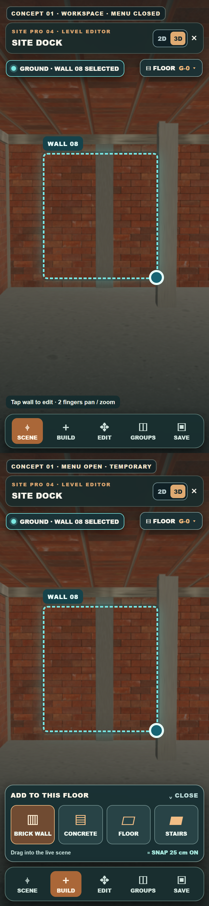
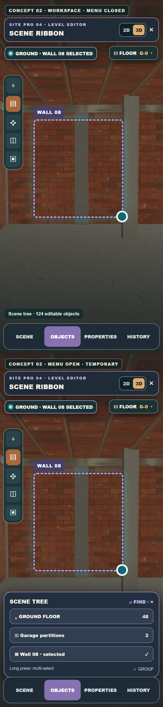
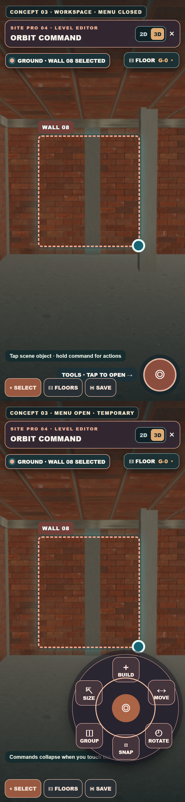
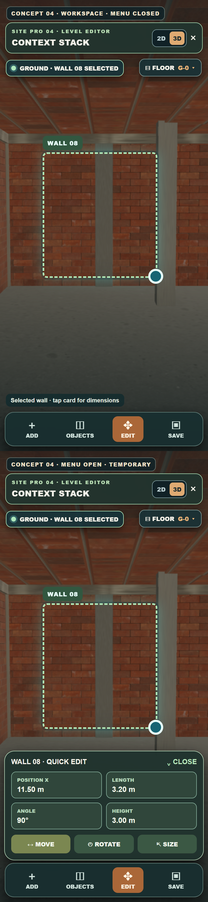
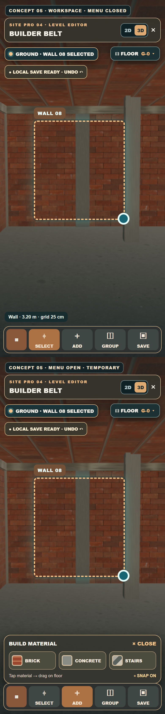

# Πέντε πλήρη mobile UI concepts για το Level Editor

Αυτές είναι οι **πέντε εναλλακτικές για ολόκληρη την πλοήγηση του Level Editor**, όχι οι πέντε ιδέες gizmo. Κάθε εικόνα έχει δύο κανονικές οθόνες mobile portrait: επάνω τον χώρο εργασίας με κλειστό μενού, κάτω το ίδιο UI με ένα προσωρινά ανοιχτό μενού. Το 3D φόντο είναι λήψη του παιχνιδιού. Τα στοιχεία UI είναι mockups προς επιλογή, όχι λειτουργίες που έχουν ήδη υλοποιηθεί.

Ο επιλεγμένος μηχανισμός χειρισμού αντικειμένου, **Orbit Halo gizmo**, είναι ανεξάρτητος από αυτά τα πέντε layouts και μπορεί να συνδυαστεί με οποιοδήποτε. Σε όλα, ο επιλογέας ορόφου και το 2D/3D παραμένουν προσβάσιμα ενώ ο κόσμος του παιχνιδιού καλύπτει το μεγαλύτερο μέρος της οθόνης. Το 2D σημαίνει live top-down όψη του ίδιου χώρου, όχι ξεχωριστό blueprint.

## 01 · Site Dock

Bottom navigation για Scene, Build, Edit, Groups, Save. Το Build ανοίγει μικρό συρτάρι υλικών πάνω από τη μπάρα. Για χρήστη που θέλει σαφείς, σταθερές θέσεις ενεργειών.

## 02 · Scene Ribbon

Στενή πλαϊνή λωρίδα εργαλείων και κάτω εναλλαγή Scene, Objects, Properties, History. Το προσωρινό Scene Tree επιτρέπει εύρεση, πολλαπλή επιλογή και ομάδες χωρίς μόνιμο μεγάλο panel.

## 03 · Orbit Command

Μικρός κόμβος εντολών όσο δουλεύεις. Με άγγιγμα ανοίγει προσωρινός τροχός Build, Move, Rotate, Size, Group, Snap. Το κάτω μέρος κρατά Select, Floors και Save.

## 04 · Context Stack

Λιτή κάτω πλοήγηση Add, Objects, Edit, Save. Με επιλογή αντικειμένου ανοίγει μόνο όταν ζητηθεί κάρτα με ακριβή θέση, μήκος, γωνία, ύψος και χειρισμούς.

## 05 · Builder Belt

Χαμηλή εργοταξιακή μπάρα Select, Add, Group, Save. Το Add φέρνει προσωρινή παλέτα τούβλου, σκυροδέματος και σκάλας. Το snap και η κατάσταση αποθήκευσης μένουν ευδιάκριτα.

Όλα είναι 390 × 844 CSS pixels ανά οθόνη, με εξαγωγή εικόνας @2×. Η όψη «menu closed» διατηρεί το μεγαλύτερο μέρος της οθόνης για το παιχνίδι. Οι οθόνες «menu open» δείχνουν προσωρινά panels που κλείνουν μόλις επιστρέψεις στην επεξεργασία του χώρου.
