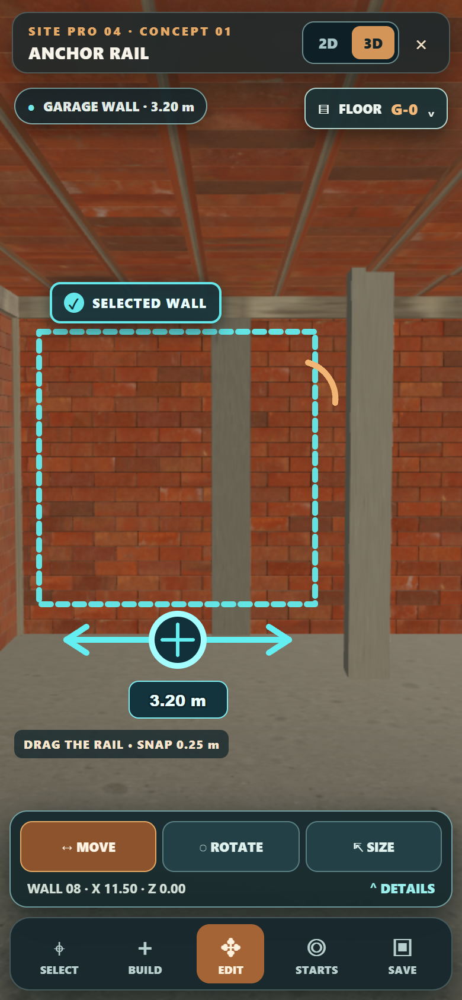
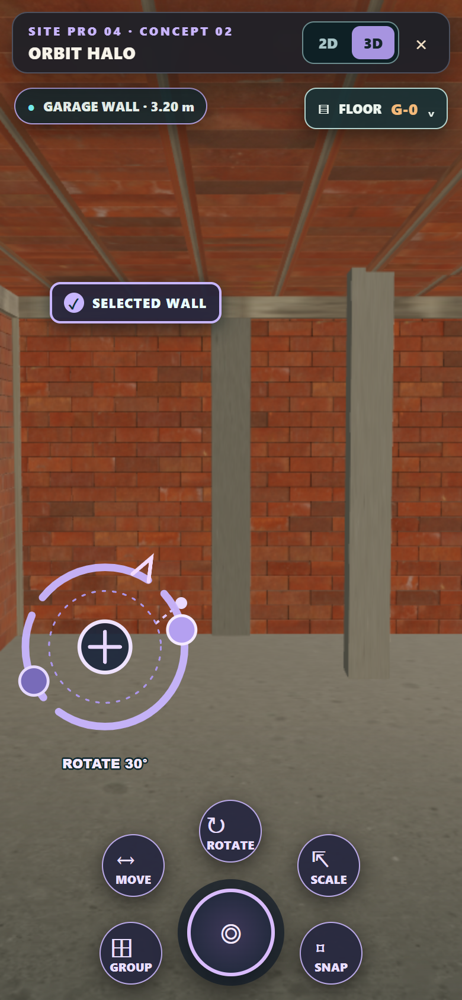
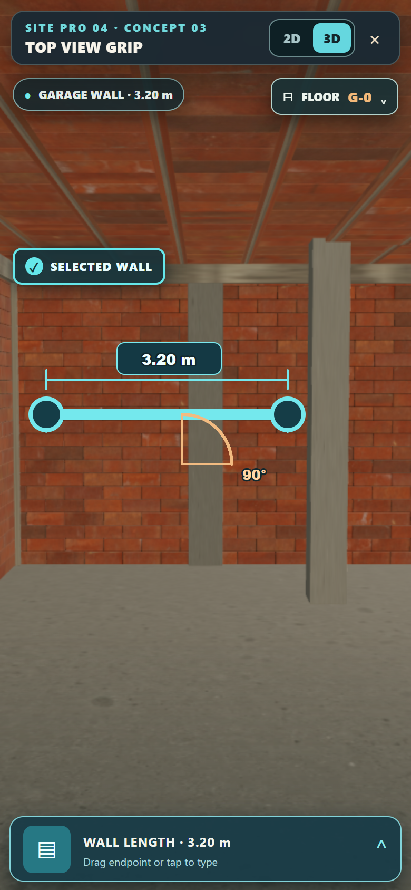
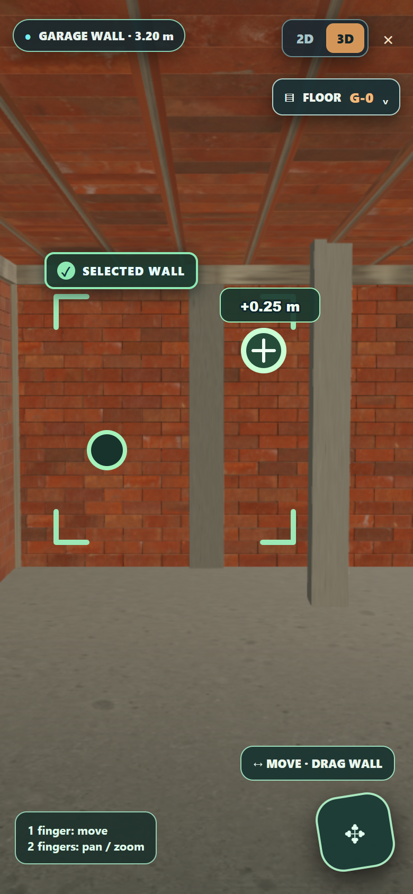
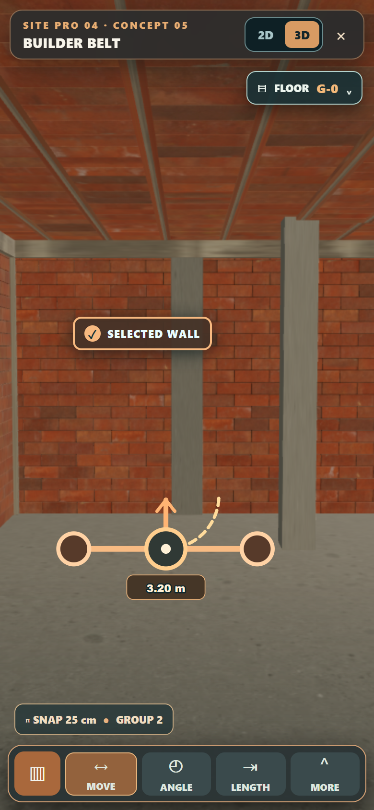

# Πέντε παραδείγματα χειρισμού επιλεγμένου αντικειμένου

Για τα **πέντε πλήρη UI concepts του Level Editor** με κλειστό και ανοιχτό μενού, δες τη [νέα συλλογή πλήρους UI](EDITOR-UI-FULL-GALLERY.md). Οι εικόνες παρακάτω εστιάζουν στον χειρισμό ενός επιλεγμένου τοίχου και στα gizmos.

Αυτή είναι η συλλογή **UI layouts**. Το επιλεγμένο gizmo είναι το **02 Orbit Halo** και μπορεί να μπει σε όποιο layout επιλεγεί. Οι εικόνες είναι mockups πάνω σε πραγματική λήψη του παιχνιδιού, όχι ήδη λειτουργικά screenshots του νέου UI. Το εικονίδιο `FLOOR G-0` ανοίγει προσωρινά την επιλογή B2, B1, G-0, 01, 02, 03, 04. Η όψη `2D` είναι ο ίδιος live 3D χώρος από πάνω, όχι blueprint.

## 01 · Bottom navigation και contextual tool rail

Σταθερή κάτω μπάρα μόνο για τις βασικές ενότητες του editor. Όταν επιλέγεις αντικείμενο, ανοίγει ακριβώς από πάνω μία χαμηλή μπάρα Move / Rotate / Size. Ο χώρος μένει πλήρως ορατός πάνω από αυτές.

[Όψη από πάνω](concept-01-2d.png) · [Επιλογέας ορόφων ανοιχτός](concept-01-floors.png)

## 02 · Radial UI

Οι πράξεις εμφανίζονται γύρω από έναν κάτω κεντρικό κόμβο. Μπορούν να διπλώνουν όταν δουλεύεις με το αντικείμενο, αλλά καταλαμβάνουν περισσότερο χώρο όταν ανοίγουν.

[Όψη από πάνω](concept-02-2d.png) · [Επιλογέας ορόφων ανοιχτός](concept-02-floors.png)

## 03 · Measurement tab

Μία λεπτή κάρτα στο κάτω μέρος ανοίγει μόνο όταν χρειάζεσαι μήκος, γωνία ή ακριβή πληκτρολόγηση. Δίνει έμφαση στην επεξεργασία από πάνω.

[Όψη από πάνω](concept-03-2d.png) · [Επιλογέας ορόφων στο 2D](concept-03-2d-floors.png)

## 04 · Minimal floating UI

Σχεδόν όλη η οθόνη είναι ο χώρος του παιχνιδιού. Ένα μικρό floating control ανοίγει τις πράξεις και τα hints εμφανίζονται μόνο όταν χρειάζονται.

[Όψη από πάνω](concept-04-2d.png) · [Επιλογέας ορόφων ανοιχτός](concept-04-floors.png)

## 05 · Compact builder belt

Μία χαμηλή κατασκευαστική μπάρα στο κάτω μέρος συγκεντρώνει Move, Angle, Length και More. Είναι η πιο συμπαγής εκδοχή μόνιμου bottom navigation.

[Όψη από πάνω](concept-05-2d.png) · [Επιλογέας ορόφων ανοιχτός](concept-05-floors.png)
