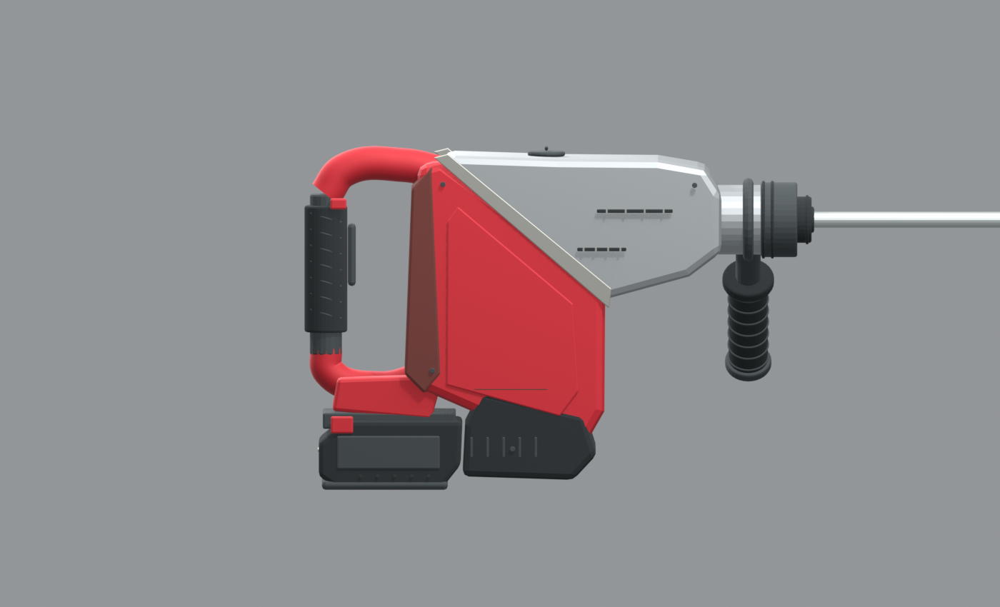
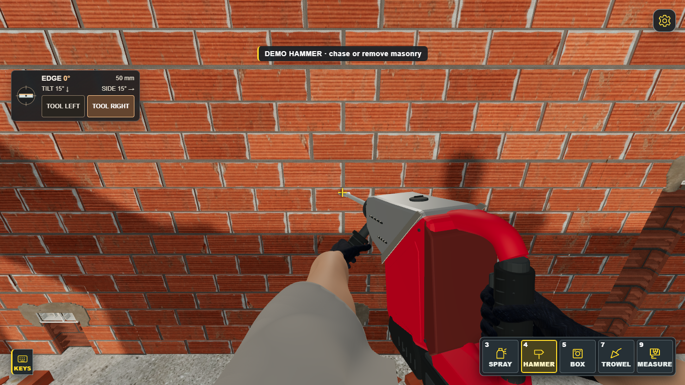

# Νέο SDS Max — εικόνες προεπισκόπησης

## Μοντέλο

Render του επεξεργάσιμου μοντέλου Blender, δημιουργημένου με οπτική αναφορά το Milwaukee M18 FHACO745. Δεν είναι επίσημο μοντέλο CAD της Milwaukee.

[Άνοιγμα εικόνας σε πλήρες μέγεθος](model-side.png?raw=true)

## Μέσα στο παιχνίδι

Πραγματικό screenshot από την τοπική έκδοση του παιχνιδιού, με το εργαλείο και τα χέρια στη στάση εργασίας.

[Άνοιγμα screenshot σε πλήρες μέγεθος](in-game.png?raw=true)

Η δημοσίευση αυτή αφορά τις εικόνες προεπισκόπησης. Η νέα έκδοση του εργαλείου δεν έχει δημοσιευτεί στο GitHub Pages παιχνίδι.