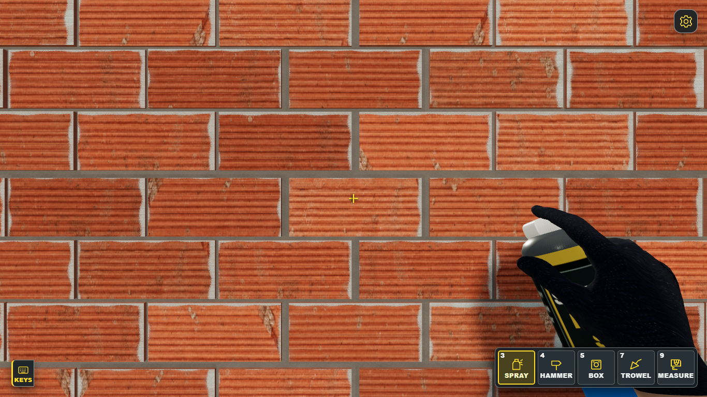
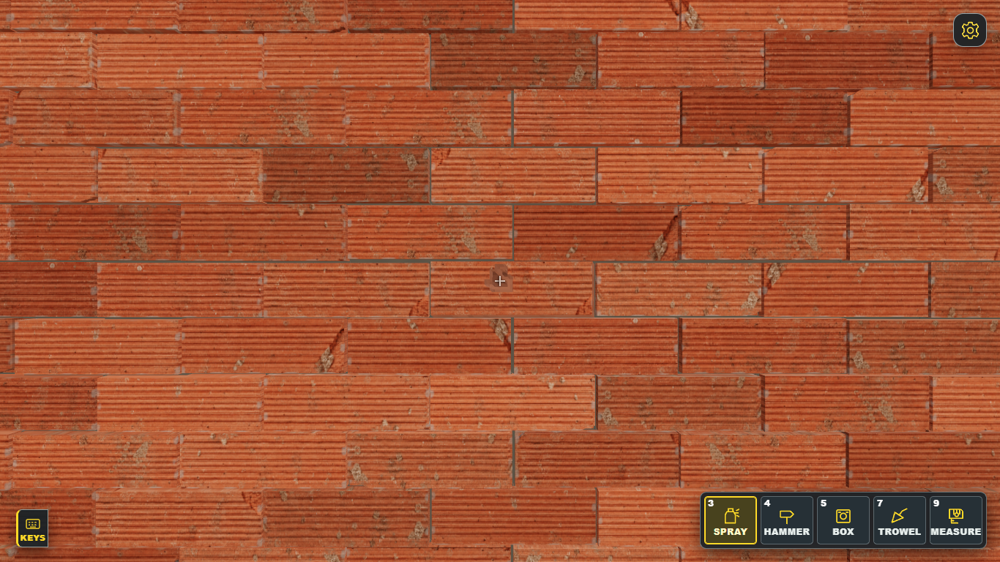
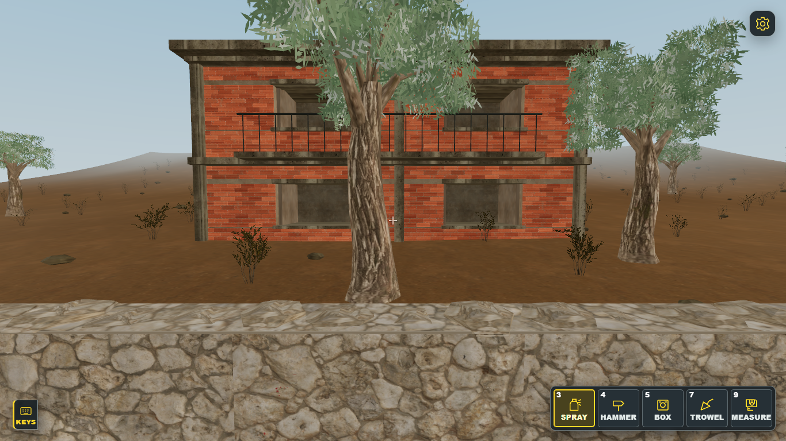
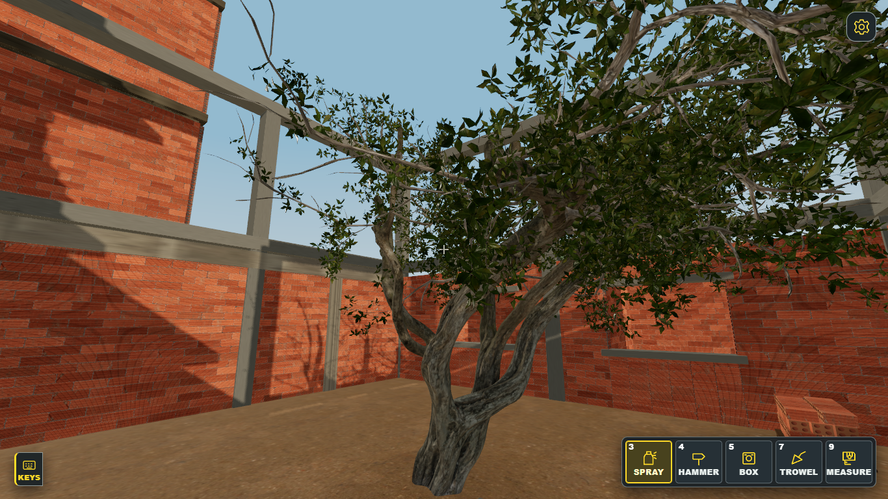

# Visual upgrades — πραγματικά καρέ και assets

Εδώ είναι συγκεντρωμένες οι οπτικές αλλαγές που είχαν ενσωματωθεί στο παιχνίδι έως το commit `4def8c7`. Περιλαμβάνει **124 screenshots** και **20 αρχεία υλικών/μοντέλων**. Άνοιξε το [ευρετήριο με κάθε screenshot](ALL-SCREENSHOTS.md) ή τους φακέλους παρακάτω.

**Αυτές είναι μερικές υλοποιημένες βελτιώσεις, όχι το τελικό οπτικό αποτέλεσμα όλου του παιχνιδιού.** Οι εικόνες concept δεν περιλαμβάνονται. Τα `live-after` καρέ προέρχονται από το ενσωματωμένο checkout της θύρας 5365. Άλλα καρέ τεκμηριώνουν απομονωμένες δοκιμές που ενσωματώθηκαν αργότερα. Τα mobile screenshots είναι Chrome viewport emulation σε Windows, όχι έλεγχος σε φυσικό τηλέφωνο.

## Άνοιξε μια περιοχή

| Περιοχή | Screenshots | Τι δείχνουν |
| --- | ---: | --- |
| [Κύριο δωμάτιο και τοίχοι](screenshots/front-wall-mortar/) | 35 | Ολόκληρη περιήγηση: τοίχοι, οροφή, δάπεδο, ανοίγματα και κοντινά τούβλων |
| [Atlas τούβλων](screenshots/brick-atlas-v3/) · [αρμοί](screenshots/workwall-mortar/) · [φθορά](screenshots/brick-humanization/) | 9 | Πρόσωπα πηλού, κονίαμα και παραλλαγές μονάδων |
| [Σπασίματα και ακμές](screenshots/mansion-brick-edge/) · [αρμοί](screenshots/mansion-joint-fracture/) · [τρύπες](screenshots/mansion-fracture-ends/) | 12 | Τοπική ζημιά και εμφανείς κυψέλες τούβλων |
| [Πλευρικοί τοίχοι](screenshots/original-side-clay-wear/) · [εσοχές](screenshots/recessed-clay-wear/) · [διατηρημένος πηλός](screenshots/mansion-retained-clay/) | 6 | Φθορά και στρώσεις στις άλλες τοιχοποιίες |
| [Οροφές, κουτιά, εργαλεία και HUD](screenshots/visual-overhaul/) | 34 | Σκυρόδεμα, ηλεκτρολογικά κουτιά, τρυπάνι, γάντια, σπρέι και mobile χειριστήρια |
| [Ηλεκτρικός πίνακας](screenshots/db-hardware-visual/) | 6 | Κενό και εξοπλισμένο **μοντέλο επιθεώρησης**· δεν είναι τοποθετημένο στον χώρο gameplay |
| [Περίβολος](screenshots/limestone-boundary/) · [γειτονικό κτίριο](screenshots/neighbour-clay/) · [ξηρό οικόπεδο](screenshots/mansion-field/) | 15 | Εξωτερικά υλικά και όψεις desktop/mobile |
| [Δέντρο αυλής](screenshots/courtyard-tree/) · [σπασμένα τούβλα δαπέδου](screenshots/site-floor-debris/) · [μίξερ](screenshots/site-mixer-wear/) | 7 | Σαρωμένο δέντρο, υπολείμματα και φθορά εξοπλισμού |

## Δείγματα από το παιχνίδι

| Τοίχος εργασίας | Σπασμένος mansion τοίχος |
| --- | --- |
|  |  |

| Εξωτερικό | Αυλή |
| --- | --- |
|  |  |

## Αρχεία που χρησιμοποιεί το παιχνίδι

Ο [φάκελος assets](assets/) περιέχει αντίγραφα των 20 εικόνων και μοντέλων που προστέθηκαν ή άλλαξαν σε αυτή τη σειρά αναβαθμίσεων: atlas πηλού, υφές σκυροδέματος/πέτρας/ξύλου/μίξερ/εργαλείων, βλάστηση και μοντέλο εργάτη. Περιέχει επίσης τις υπάρχουσες σημειώσεις προέλευσης και άδειας όπου υπάρχουν. Τα runtime αρχεία παραμένουν στις κανονικές θέσεις τους στο [`public/assets`](../public/assets/).

Το [παιχνίδι στο GitHub Pages](https://arisconstantinou.github.io/Electrical-Game/) δείχνει την ενσωματωμένη έκδοση. Το νέο δοκιμαστικό δέντρο έξω από το παράθυρο **δεν** περιλαμβάνεται εδώ, επειδή δεν είχε ολοκληρωθεί η οπτική επαλήθευσή του.
